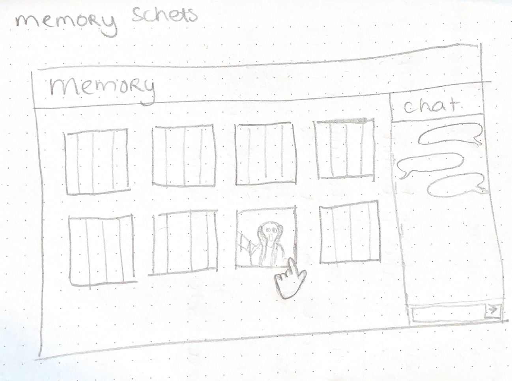
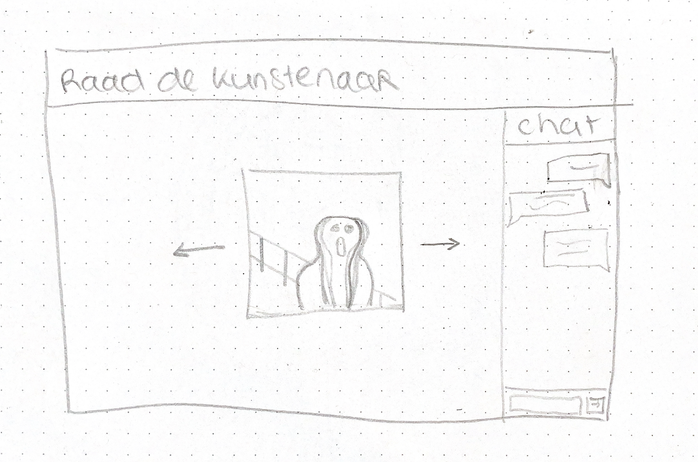

# Real-Time Web @cmda-minor-web · 2020/21

# Like link:

## Table of Contents
- Beschrijving 
- Concept

### Beschrijving
Voor dit vak gaan we een socket app maken. Hierbij moet je een aantal concepten bedenken, een API gebruiken en realtime communicatie gebruiken. 

### Concept
Als concept wil ik een spel gaan maken.
#### Concept 1: Memory spel
Hierbij wil ik kunst uit het rijksmuseum gebruiken.

In de chat kun je communiceren met de andere spelers.
Klik op een plaatje om hem om te draaien en zoek vervolgens dezelfde.

##### Hoe te bouwen:
- Begin met HTML, CSS en JS opzetten
- API call
- Render homepage
- Maak chat functie
- Deel memory choices met andere gebruikers

#### Concept 2: Kunstenaar raden spel
Hierbij wil ik kunst uit het rijksmuseum gebruiken.

In de chat kun je communiceren met de andere spelers.
Bekijk het plaatje en raad de kunstenaar.

##### Hoe te bouwen:
- Begin met HTML, CSS en JS opzetten
- API call
- Render homepage
- Maak chat functie
- Chat herken antwoorden

#### Concept 3: Kunst naam raden spel
Hierbij wil ik kunst uit het rijksmuseum gebruiken.

In de chat kun je communiceren met de andere spelers.
Bekijk het plaatje en raad de naam van het kunstwerk in de chat.

##### Hoe te bouwen:
- Begin met HTML, CSS en JS opzetten
- API call
- Render homepage
- Maak chat functie
- Chat herken antwoorden

<!-- ☝️ replace this description with a description of your own work -->

<!-- Add a nice image here at the end of the week, showing off your shiny frontend 📸 -->

<!-- Maybe a table of contents here? 📚 -->

<!-- How about a section that describes how to install this project? 🤓 -->

<!-- ...but how does one use this project? What are its features 🤔 -->

<!-- What external data source is featured in your project and what are its properties 🌠 -->

<!-- This would be a good place for your data life cycle ♻️-->

<!-- Maybe a checklist of done stuff and stuff still on your wishlist? ✅ -->

<!-- How about a license here? 📜  -->
