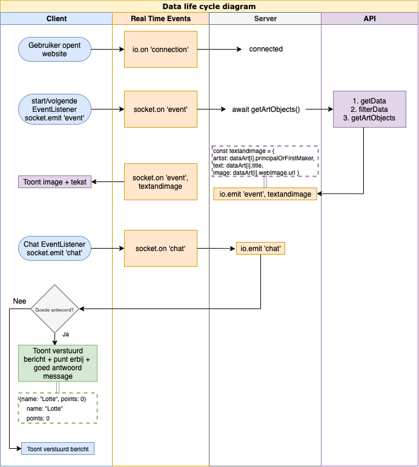

# Real-Time Web @cmda-minor-web · 2020/21

# Like link:
https://rijks-game.herokuapp.com/

## Table of Contents
- Beschrijving 
- Drie Concepten
- Gekozen Concept
- Moscow
- API
  - Welke API heb ik gebruikt
  - API Inhoud
  - Hoe gebruikt
  - API key
  - Real-Time Events
- Data Lifecycle Diagram
- Used Packages
- Install project
- License
- Sources

### Beschrijving
Voor dit vak gaan we een socket app maken. Hierbij moet je een aantal concepten bedenken, een API gebruiken en realtime communicatie gebruiken. 

### Drie Concepten
Als concept wil ik een spel gaan maken.
#### Concept 1: Memory spel
Hierbij wil ik kunst uit het rijksmuseum gebruiken.


In de chat kun je communiceren met de andere spelers.
Klik op een plaatje om hem om te draaien en zoek vervolgens dezelfde.

##### Hoe te bouwen:
- Begin met HTML, CSS en JS opzetten
- API call
- Render homepage
- Maak chat functie
- Deel memory choices met andere gebruikers


#### Concept 2: Kunstenaar raden spel
Hierbij wil ik kunst uit het rijksmuseum gebruiken.


In de chat kun je communiceren met de andere spelers.
Bekijk het plaatje en raad de kunstenaar.

##### Hoe te bouwen:
- Begin met HTML, CSS en JS opzetten
- API call
- Render homepage
- Maak chat functie
- Chat herken antwoorden

#### Concept 3: Kunst naam raden spel
Hierbij wil ik kunst uit het rijksmuseum gebruiken.


In de chat kun je communiceren met de andere spelers.
Bekijk het plaatje en raad de naam van het kunstwerk in de chat.

##### Hoe te bouwen:
- Begin met HTML, CSS en JS opzetten
- API call
- Render homepage
- Maak chat functie
- Chat herken antwoorden

### Gekozen concept
Ik heb gekozen voor concept 2, raad je kunstenaar.
Het werkt zo: Er verschijnt een kunstwerk op je scherm en het scherm van je medespelers. Wie als eerste de goede kunstenaar raad in de chat wint. Wanneer het goede antwoord gegeven is, verschijnt er een nieuw kunstwerk en begint het spel opnieuw.

### Moscow
#### Must have:
- [x] Chat voor antwoorden met namen
- [x] Api connectie
- [x] Met socket.io kunstwerken laten zien aan de users
- [x] In de chat antwoorden kunnen herkennen
- [x] Volgende knop

#### Should have:
- [x] Styles
- [ ] Database voor gebruikers en antwoorden
- [ ] Naam niet verwijderen wanneer je op volgende klikt
- [x] Als er een nieuwe gebruiker in het spel komt, niet page reloaden (wat hiervoor wel gebeurde)

#### Could have:
- [ ] Punten telling
- [x] Skip knop (zelfde als volgende knop geworden)
- [ ] Rondes

#### Would have:
- [ ] Rooms voor verschillende groepen gebruikers
- [ ] Filters dat je uit periodes kan kiezen, of uit Nederlandse kunstenaren kunst kiezen.

### API
#### Welke API:
Ik heb de Rijksmuseum API gebruikt: https://www.rijksmuseum.nl/api/nl/collection/?key=7TAeATmh

#### API Inhoud:
```
"artObjects": [
  {
    "links": {}                     // link naar item op rijkmuseum website en in de api
    "id":                           // combinatie van collectie en objectnummer 
    "objectNumber":                 // nummer en cijfer combinatie
    "title": "Bureau",              // korte titel     
    "principalOrFirstMaker":        // orginele kunstenaar
    "longTitle":                    // lange titel van het kunstwerk
    "webImage": {}                  // Image met url en afmetingen
    "headerImage": {}               // Image in header grootte met url en afmetingen
    "productionPlaces": []          // Plek(ken) waar het kunstwerk gemaakt is
  }
```

#### Hoe gebruikt:
- getData function: 
```
const getData = url => {
  return fetch(url)
    .then(res => res.json())
    .catch(_ => null)

   module.exports = getData
}
```
- filterData function:
```
const artists = ['Johannes Vermeer', 'Rembrandt van Rijn', 'Vincent van Gogh', 'Karel Appel']
const filteredData = data.artObjects.filter(artObject => {
  return artists.includes(artObject.principalOrFirstMaker)
 })
  return filteredData
```
- sortData function:
```
const sortedArtObjects = data.sort(() => .5 - Math.random())
 return sortedArtObjects
```
- socket.io filteredData sturen naar alle users:
```
socket.on('image', (textandimage) => { 
  text.innerText = textandimage.text;
  picture.src = textandimage.image;
})
```


#### API key:
Je kunt op de website van het rijksmuseum een account aanmaken en dan wordt de API key naar je opgestuurd in een mail.

Gebruik hiervoor deze twee websites: 
- Algemene API info: https://data.rijksmuseum.nl/object-metadata/api/
- Account aanmaken voor API key: https://www.rijksmuseum.nl/nl/registreer
Nadat je een account hebt aangemaakt, ga je naar je account, naar instellingen en onderaan staat een kopje Rijksmuseum API. Hier kun je de Key aanvragen.


#### Real-Time Events
- Connection: <br>
```
io.on('connection', async socket => {
```
- Image sturen:<br>
```
const dataArt = await getArtObjects()
  const textandimage = { 
   text: dataArt[0].title,
    image: dataArt[0].webImage.url 
    } 
  io.emit('image', textandimage) 
```
- Messages sturen:
```
 socket.on('chat', data => {
  io.emit('chat', data)
```
- Antwoord en volgende image:

### Data Lifecycle Diagram


### Used Packages
- express
- http
- node-fetch
- socket.io
- dotenv
- ejs
- nodemon

Install:
1. npm install
2. npm install express, http, node-fetch, socket.io
3. npm install -D dotenv, ejs, nodemon
4. require: `const ... = require('...')`


### Install project
1. clone repo: 
``` 
https://github.com/Lottetekulve/Rijksmuseum-spel.git
```
2. Install used packages: 
```
npm install
```
3. Start op het web: 
```
npm run dev
```
4. Te vinden op: http://localhost:4000/

### License
### Sources

<!-- Add a nice image here at the end of the week, showing off your shiny frontend 📸 -->


<!-- ...but how does one use this project? What are its features 🤔 -->

<!-- This would be a good place for your data life cycle ♻️-->

<!-- How about a license here? 📜  -->
